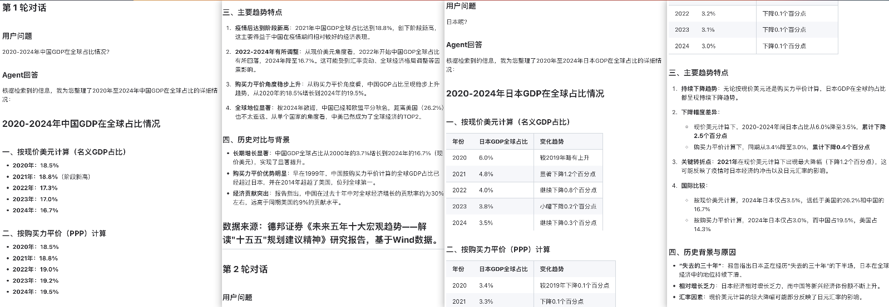
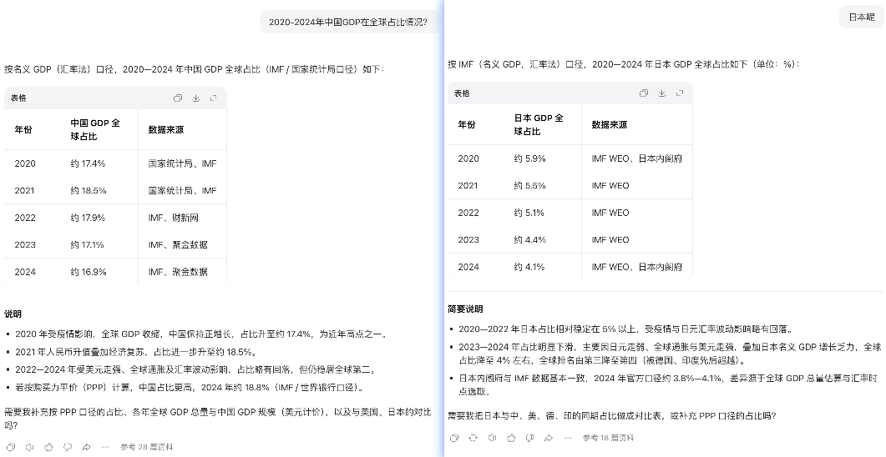
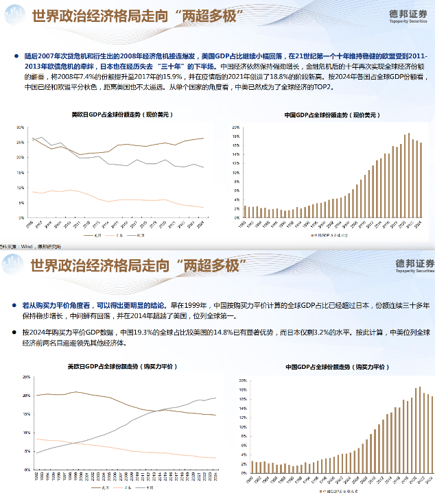

# 企业级通用 Deep Agent RAG 

让大模型像人类研究员一样主动思考翻页查询资料进行内部知识库检索。支持垂直领域知识库自动化效果评估。支持图表、公式、表格等知识检索。

---

### 一、核心思想：react+deepsearch

主 Agent 与 子Agent 上下文天然隔离，主Agent在调用子Agent前自适应实现指代消解/省略恢复/改写过程。

子 Agent 采用react + deepsearch模式，根据初步检索得到的文本片段信息，判断重点阅读哪些文件的哪些页面(file_id, page_index)，阅读重点页面内容后判断是继续生成新的检索serp执行检索或是定位到新的重点页面(file_id, page_index)。文本块检索和重点页面获取作为子Agent的两个工具，让模型根据环境结果自主决策、不断迭代上述流程，直到收集信息足够支持回答用户query。


---

### 二、问答效果
**Deep Agent RAG（非思考模式）对话效果如下**


**豆包（非思考模式）对话效果如下**


**知识库文件定位**




**对比效果分析：**

Deep Agent RAG在定位到图表文本块后主动查阅所在PPT页，得到以现价美元为标准的GDP信息，后主动查阅第7页PPT得到以购买力为标准的GDP信息，值得惊喜的是：第7页PPT的第二个图表数据错误，但第一个图表正确，鉴于现价美元PPT页面的数据信息，子Agent自动忽略了错误信息，以第一个图表中的数据为准生成答案。

豆包关于日本GDP数据的回答与Deep Agent RAG略有出入，源于豆包参考数据源与 Deep Agent RAG内部数据源 原始数据的出入。

---

### 三、技术架构

### 1. 文件上传模块：
异步文件上传接口 oss+mysql 存储原始文件信息。

---

### 2. 知识库构建模块：
后台定时任务，从mysql中拉取最新的待处理文件，后台执行文件知识入库流程：paddleocr-vl版面解析 -> 文本切块 -> 知识关联 -> embedding构建 -> 知识入库(ES、mysql)实时更新

**版面解析：**
使用paddleocr-vl进行版面解析，<u>支持图表、公式、表格等富文本信息识别，保留文档原始数据信息和版面布局。</u>

**文本切块：**
支持多种切块模式：

```
"markdown_ast"：推荐。使用AST语法分析树进行Markdown文本切分。保留完整的图表、表格、公式块（最大保留文本块语义完整性）
"recursive"：RecursiveCharacterTextSplitter 通用字符切分
"markdown_header"：MarkdownHeaderTextSplitter 按标题切分
"markdown_then_recursive"：先按标题切分再递归字符切分
```

**Embedding模型：**
BAAI/bge-m3

---

### 3. 知识检索模块：
知识检索以 <u>子Agent</u> 的形式注入到主对话Agent中。实现 子Agent 的工具调用检索过程上下文和 主对话Agent 的上下文天然隔离。

知识检索支持两种模式的知识检索：（1）React+deepsearch Agent模式（2）二次上下文重排+上下文扩展。

#### 3.1 React+deepsearch Agent主动检索模式
让模型根据初步检索得到的文本片段信息，判断重点阅读哪些文件的哪些页面(file_id, page_index)，阅读重点页面内容后判断是继续生成新的检索serp执行检索或是定位到新的重点页面(file_id, page_index)。文本块检索和重点页面获取作为模型的两个工具，让模型根据环境结果自主决策、不断迭代上述流程，直到信息足够支持回答用户query。

给大模型接入两个工具：`快速检索召回文本块`、`获取重点阅读文本页`\
信息检索工具：初次检索召回top20->上下文各扩展1个文本块->上下文重排获取top10 扩展后的文本块\
重点页面查阅工具：根据file_id和chunk_index获取指定文本页内容

#### 3.2 二次上下文重排+上下文扩展模式
**首次重排**：对检索结果进行第一次重排\
**扩展**：按照重排结果排名顺序进行上下文扩展，根据排名从1-20，上下文各扩展文本块10-1个。使得高分文本块获得更多的扩展上下文，使在文档中相邻但未被召回的前后文本块能纳入候选集。\
**二次重排**：对扩展后的候选集再次重排，筛选出最终输入大模型的最优内容。
该流程先定位对query重要的段落，再对重要段落进行上下文扩展，最终结合更完整语境判断与query的相关性。


#### 3.3 上下文重排模型
rerank部分使用 上下文重排模型 

为什么使用上下文重排模型？

示例：query：深度学习和强化学习之间的关系是什么？\
传统重排给chunk3一个最低分。上下文重排模型给chunk3一个最高分。而chunk3才是需要参考的关键知识。

```
chunk1"深度学习xxx",
chunk2"强化学习是xxx",
chunk3"两者之间的关系是：循序渐进、相辅相成。",
chunk4"强化学习的学习路线是：xxx",
```

传统重排模型给每个chunk独立打分。一次只给一个chunk+query打分，chunk1的打分只与query有关，模型给chunk1打分的时候不参考chunk2、chunk3的信息。

上下文重排采用整体评估模式。将初步检索到的多个候选文本块按原始chunk index顺序排列后，与query一起组成一段长文本，一次性输入给重排模型。这样，重排模型能够感知检索内容间的语义关联，更准确地评估各部分内容相对于提问的重要程度。

---

### 4. 主对话模块
主Agent以工具调用的形式执行知识检索模块。支持强制检索和自主决策检索两种模式。

---

### 5. 自动化评测模块
凌晨自动执行后台定时任务，获取新增知识信息，自动生成与文本块关联的question + answer问答对（可跨多个文本页）测试集。

自动跑批测试集，调用chat接口，获取Agent答案以及参考的文本块信息。

对于检索阶段评测：直接计算文本块召回率recall。\
对于回答阶段评测：从事实一致性和内容全面性两个方面分别进行0/1打分。


